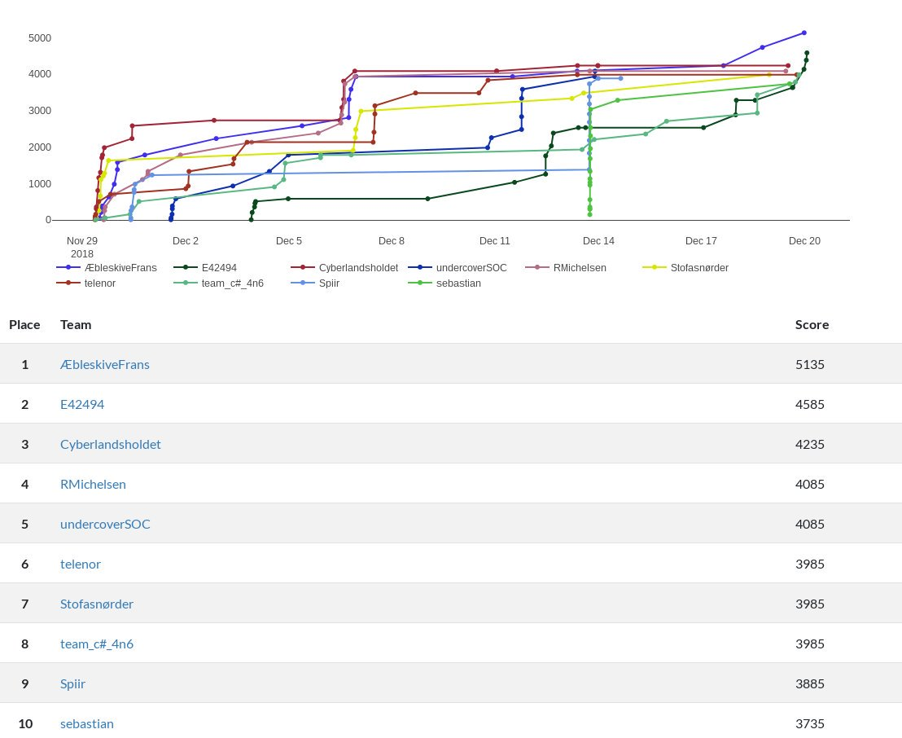
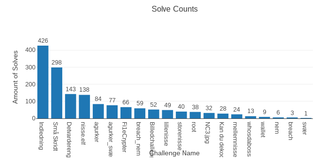

# NC3 Jule CTF 2018

NC3 afholdte en [CTF](https://en.wikipedia.org/wiki/Capture_the_flag) i December 2018 for at sætte fokus på IT-sikkerhed. En CTF kan kort beskrives som en hackerkonkurrence, hvor det handler om at bryde forskellige sikkerhedsforanstaltninger. Målet med hver opgave er at finde et "flag", dvs. en tekst, som opgaven prøvede at holde hemmelig.

**Flag format:** NC3{flag}

**URL:** http://nc3s4mmxv5lhq7xs.onion/

**Web-kode baseret på:** https://ctfd.io/

&nbsp;
&nbsp;
&nbsp;

# Resultat

&nbsp;
&nbsp;
&nbsp;
&nbsp;

# Writeups

Konceptet omkring writeups er enkelt: En gennemgang af hvordan en opgave kan løses.

Især i [infosec](https://en.wikipedia.org/wiki/Information_security) community'et er der en positiv tendens til at skrive writeups efter en endt CTF. Dette giver jo andre en mulighed for at se hvordan en opgave kunne løses. Hvis man f.eks. selv ikke kunne få hul på en given opgave under konkurrencen, er det derfor yderst interessant at se efterfølgende hvad man kunne have gjort. Ligeledes kunne det være at man allerede havde løst en given opgave, men gerne ville have inspiration til evt. andre løsninger.
 
Sådanne writeups var der heldigvis flere deltagere der lavede efter jule CTF'en. Herunder følger de officielle writeups, samt dem som vi har fundet indtil videre på nettet.

# Opgaver / Challenges

Deltagerene fik opgaver i forskellige kategorier. Efter konkurrencen var alle opgaver løst:

&nbsp;
&nbsp;
&nbsp;
&nbsp;

# Officielle Writeups

[Reversing - Indledning](opgaver/writeups/reversing_indledning.html.md)

[Reversing - Små Skridt](opgaver/writeups/reversing_små-skridt.html.md)

[Reversing - nisse.elf](opgaver/writeups/nisse.elf.md)

[Reversing - Fi1eCrypter](opgaver/writeups/ransomware_fi1ecrypter.zip.md)

[Reversing - Kan du dekode?](opgaver/writeups/reversing_kan-du-dekode.php.md)

&nbsp;
&nbsp;
&nbsp;
&nbsp;

## Community Writeups - Flere forskellige

https://github.com/NicolaiSoeborg/ctf-writeups/tree/master/2018/NC3%20Jule%20CTF%202018

https://github.com/kkthxbye-code/NC3-CTF-2018-Writeup

https://github.com/svindlerdk/ctf-writeups/tree/master/nc3ctf2018

## Community Writeups - NC3.jpg

https://www.youtube.com/watch?v=CW0xcyt26kk

## Community Writeups - Boot2Root

https://www.youtube.com/watch?v=WpDN_Z3MrZ8

## Community Writeups - breach_nem

https://www.youtube.com/watch?v=jYm5MyVgHG4
