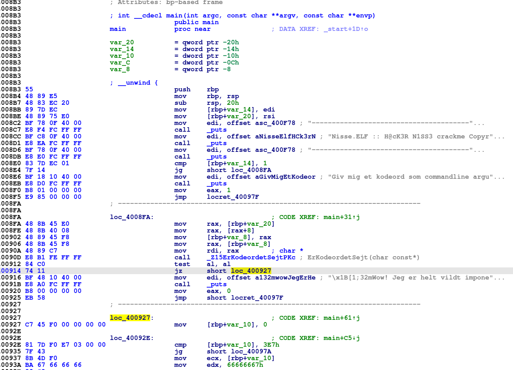
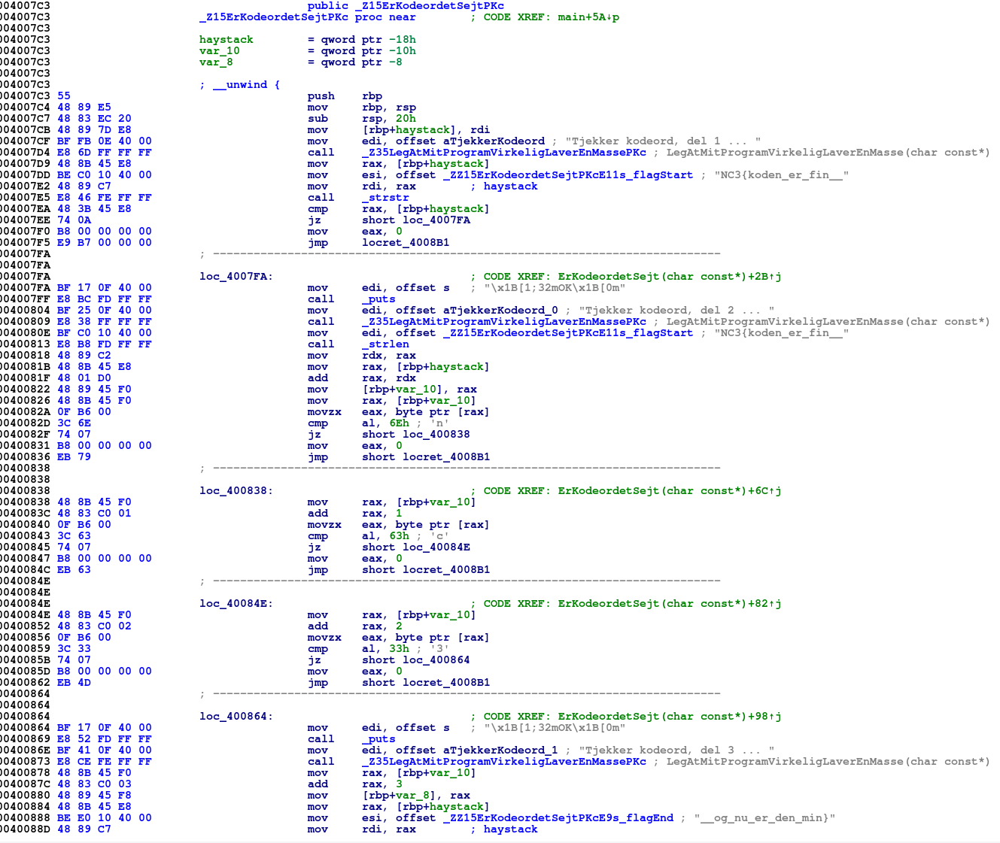

# nisse.elf

[Download](bin/nisse.elf)

**Mål:** Introducerer reversing af eksekverbare filer (programmer).

## 
Vi bruger her Linux, mere specifikt bruges f.eks. [Ubuntu](https://ubuntu.com/), [Kali](https://www.kali.org/) eller [Parrot](https://parrotlinux.org/). Dette gøres fordi [APT](https://en.wikipedia.org/wiki/APT_(Package_Manager)) indeholder nogle gode værktøj til analyse af diverse filtyper.

For at vide hvilken fil, vi har med at gøre, bruger vi f.eks. det indbyggede [file](https://en.wikipedia.org/wiki/File_(command)) program:

```bash
$ file nisse.elf 
nisse.elf: ELF 64-bit LSB executable, x86-64, version 1 (SYSV), dynamically linked, interpreter /lib64/ld-linux-x86-64.so.2, for GNU/Linux 2.6.32, BuildID[sha1]=82c0bb93a83198f4cb11ea9873f55ce8302c8752, not stripped
```

Filen er altså et program i .ELF formatet, og der vises klart at der er tale om linux til almindelig PC (64 bit).

Et andet lille nyttig program er [strings](https://en.wikipedia.org/wiki/Strings_(Unix)), som viser hvilke tekst-strenge, der gemmer sig i en fil:

```Shell
$ strings nisse.elf
/lib64/ld-linux-x86-64.so.2
libc.so.6
fflush
nanosleep
puts
...
Tjekker kodeord, del 1 ... 
[1;32mOK
Tjekker kodeord, del 2 ... 
Tjekker kodeord, del 3 ... 
[1;33mS
------------------------------------------------------------------------
Nisse.ELF :: H@cK3R N1SS3 crackme Copyright 2018 @ Julemandens v
rksted!
Giv mig et kodeord som commandline argument :)
[1;32mWow! Jeg er helt vildt imponeret over dine haXX0r skillz! Du er en vild nisse!
[1;%imFORKERT!
NC3{koden_er_fin__
__og_nu_er_den_min}
...
nisse.cpp
...
_ZZ15ErKodeordetSejtPKcE11s_flagStart
_ZZ15ErKodeordetSejtPKcE9s_flagEnd
...
_Z35LegAtMitProgramVirkeligLaverEnMassePKc
...
_Z15ErKodeordetSejtPKc
...
```

Vi har her vist de mest interessante tekst-strenge. Allerede nu kan vi begynde at gætte os til hvad programmet gør: Noget med et kodeord, der bliver tjekket i 3 dele.

Flere deltagere gættede med det samme på at flaget var:
```
NC3{koden_er_fin____og_nu_er_den_min}
```
Dette er dog forkert, da flaget netop er delt i 3, og ikke kun 2 dele. Der skal altså mere til.

## Dybere analyse
Vi har to tekst-strenge. Den første indeholder starten på alle flag i konkurrencen:
```
NC3{
```
og den anden tekst-streng indeholder slutningen på alle flag i konkurrencen:
```
}
```
Vi kan derfor udlede at den manglende del skal være i midten af disse to tekst-strenge:
```
NC3{koden_er_fin__UKENDT__og_nu_er_den_min}
```
Man kunne nu evt. lave en [brute forcer](https://da.wikipedia.org/wiki/Brute_force), der afprøvede alle tal/bogstavskombinationer. Men dette tager programmet højde for ved at lave en pause efter hvert forsøg. Dvs. dette er ikke realistisk. En mulighed kunne være at finde det sted i programmet, der netop laver denne pause, og simpelthen slette denne kode. Dette kræver dog kendskab til maskinkode, og hvis vi alligevel skal kigge på maskinkode, kan vi lige så godt bare gå i gang med dette ...

&nbsp;
&nbsp;
&nbsp;
&nbsp;

## Disasssembly / Maskinkode

Her krydser vi over fra at bruge almindelige analyse værktøj, til at bruge en [disassembler](https://en.wikipedia.org/wiki/Disassembler). Da dette involverer analyse af maskinekode (assembler), er dette naturligt meget sværre end de forrige reversing opgaver.
&nbsp;
Et godt råd til at lære maskinkode er at lave egne programmer i C/C++, og derefter åbne disse i en disassembler for at se hvordan programmeringskode bliver omdannet ([compilet](https://da.wikipedia.org/wiki/Compiler)) til maskinkode. Et rigtig nyttigt online værktøj er [Compiler Explorer](https://godbolt.org/), der netop tillader at compile egne kodestumper.
&nbsp;
Til at disassemble f.eks. en .ELF eller .EXE fil findes flere gode programmer. F.eks.:

* IDA Pro
* Radare2
* objdump
* Binary Ninja

Efter konkurrencen blev disassembleren fra [NSA](https://github.com/NationalSecurityAgency) udgivet: [Ghidra](https://ghidra-sre.org/). Denne indeholder en decompiler, dvs. en måde at gå fra maskinkode til C kode. At bruge en decompiler er næsten snyd i denne opgave, så vi fokuserer i stedet på maskinkoden, her vist i IDA Pro:



Da programmet er bygget med [debug symboler](https://en.wikipedia.org/wiki/Debug_symbol), kan vi se hvad programmøren har kaldt sine funktioner. Der er bl.a. et kald til funktionen "ErKodeordetSejt". Denne funktion må vi kigge nærmere på:



Her ser vi hvordan koden først tjekker del 1 af flaget. Ved "loc_4007FA" tjekkes del 2, som vi umiddelbart mangler for at kende hele flaget.
&nbsp;

Se hvordan maskinkoden tjekker et enkelt bogstav ad gangen:

```Unix Assembly
.text:000000000040082D 3C 6E                                cmp     al, 6Eh ; 'n'
.text:0000000000400843 3C 63                                cmp     al, 63h ; 'c'
.text:0000000000400859 3C 33                                cmp     al, 33h ; '3'
```

Der bliver altså tjekket på om del 2 er:

```
nc3
```

Vi har nu alle 3 dele.

&nbsp;
&nbsp;
&nbsp;
&nbsp;


## Community Writeups:

https://github.com/kkthxbye-code/NC3-CTF-2018-Writeup
