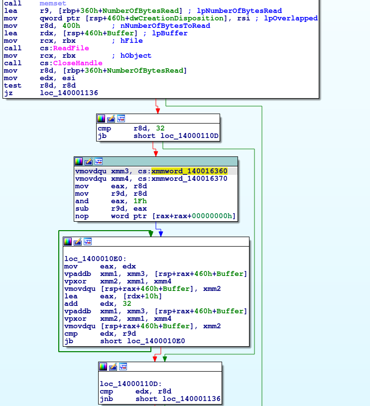
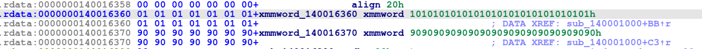
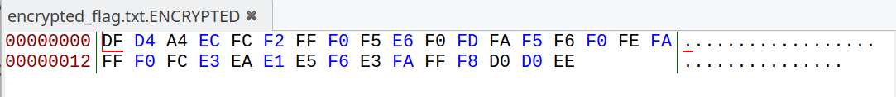
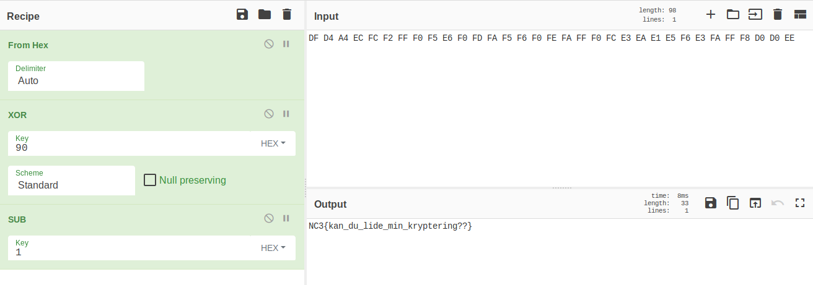

# Fi1eCrypter

[Download](../bin/ransomware_fi1ecrypter.zip)

**Mål:** Analysere simpel krypteringsalgoritme som i [Små Skridt](reversing_små-skridt.html.md), men i maskinkode til PC, uden debug symboler.

## 
Allerede ved beskrivelsen af filen, får vi et hint om at opgaven omhandler ransomware. Vi udpakker .zip filen og får 2 filer. For at vide hvilke filer, vi har med at gøre, bruger vi Linux programmet [file](https://en.wikipedia.org/wiki/File_(command)):

```Shell
$ file *
encrypted_flag.txt.ENCRYPTED: ISO-8859 text, with no line terminators
fi1ecrypter.exe:              PE32+ executable (console) x86-64, for MS Windows
```

Vi har altså et program i .EXE formatet (kaldet [PE](https://en.wikipedia.org/wiki/Portable_Executable)) som de fleste nok kender fra Microsoft Windows. Dertil en fil, der stærkt indikerer at den indeholder flaget, men i krypteret form. Det ligger ligefor at .EXE filen indeholder kode, der har genereret .ENCRYPTED-filen. Opgaven må altså bestå i at reverse den algoritme, der er brugt til at kryptere filen.

Vi kan starte med at køre et lille nyttig program, kaldet [strings](https://en.wikipedia.org/wiki/Strings_(Unix)), som viser hvilke tekst-strenge, der gemmer sig i en fil:

```Shell
$ strings fi1ecrypter.exe
!This program cannot be run in DOS mode.
):RichU
.text
`.rdata
...
log10
.ENCRYPTED
c:/temp/{1391FA76-5262-49B1-8C7C-37059DB057AD}/encrypted_flag.txt
string too long
invalid string position
...
.rsrc$01
.rsrc$02
ReadFile
WriteFile
CreateFileA
CloseHandle
KERNEL32.dll
QueryPerformanceCounter
GetCurrentProcessId
GetCurrentThreadId
GetSystemTimeAsFileTime
InitializeSListHead
...
```

Vi har her vist de mest interessante tekst-strenge: Der er [hardkodet](https://en.wikipedia.org/wiki/Hard_coding) en sti til en fil på Windows. Dertil vises diverse [Windows API](https://docs.microsoft.com/en-us/windows/win32/api/) funktioner til at læse/skrive filer. Vi bruger nu ynglings-disassembleren til a reverse filen:

## Disassembly

Opgaven blev lavet til at blive løst ved reversing af [x64](https://en.wikipedia.org/wiki/X86-64) maskinkoden. Mere specifikt blev et par [vector instruktioner](https://en.wikipedia.org/wiki/SIMD) brugt for at give en lille udfordring. Når man reverser, vil man ofte bruge noget tid på at gå fra funktion til funktion, og notere hvilke evt. eksterne funktioner, der bliver brugt. F.eks. Windows API kald. Med denne fremgangsmåde finder vi funktionen:

```
sub_140001000
```

Denne indeholder eksterne funktions kald til [CreateFile](https://docs.microsoft.com/en-us/windows/win32/api/fileapi/nf-fileapi-createfilea), [ReadFile](https://docs.microsoft.com/en-us/windows/win32/api/fileapi/nf-fileapi-readfile), osv. Her vist i IDA Pro:



Vi ser her diverse [vector instruktioner](https://en.wikipedia.org/wiki/SIMD), f.eks.:

* [vpaddb](https://software.intel.com/sites/landingpage/IntrinsicsGuide/#text=_mm_mask_add_epi8&expand=113)
* [vpxor](https://software.intel.com/sites/landingpage/IntrinsicsGuide/#text=_mm_mask_xor_epi32&expand=113,6121)

Disse instruktioner refererer til to byte arrays:



Det ses hvordan algoritmen er:

1. Encrypted Byte == UserInput Byte + 1
2. Encrypted Byte == Encrypted Byte  XOR  0x90

Vi kan nu bruge f.eks. [CyberChef](https://gchq.github.io) til at implementere denne algoritme spejlvendt: Først tager vi HEX bytes fra den krypterede fil, og kopierer dem over i CyberChef som INPUT:



Dernæst gør vi det modsatte af hvad .EXE filen gjorde:

1. Encrypted Byte == Encrypted Byte  XOR  0x90
2. Encrypted Byte == UserInput Byte - 1

Dette giver flaget:




&nbsp;
&nbsp;
&nbsp;
&nbsp;


## Community Writeups:

https://github.com/kkthxbye-code/NC3-CTF-2018-Writeup
