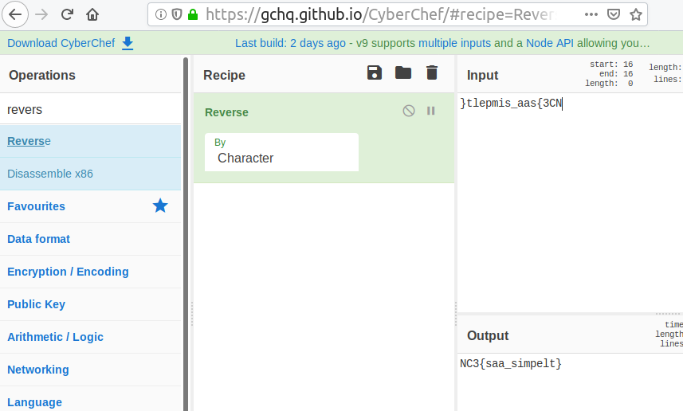

# reversing_indledning.html

[Download](bin/reversing_indledning.html)

**Mål:** Give alle en chance for at kunne løse en opgave

Filen indeholder noget HTML kode, der styres af Javascript:

```HTML
<!DOCTYPE html />
<meta charset="UTF-8">
<html>
<body>

<script>
	function reverseString(input) {
		return input.split('').reverse().join('');
	}

	function OnClick()
	{
		var flagValue = document.getElementById("flagInput").value;

		if (reverseString(flagValue) == '}tlepmis_aas{3CN')
		{
			alert('Du fandt flaget');
		}
		else
		{
			alert('Prøv igen');
		}
	}
</script>


<input type="text" id="flagInput" value="Indtast flaget:" />
<input type="button" onclick="OnClick();" />

</body>
</html>
```

[Funktioner](https://en.wikipedia.org/wiki/Subroutine)/[variabler](https://en.wikipedia.org/wiki/Variable_(computer_science)) er navngivet så de er nemme at forstå, og funktionen "reverseString" gør f.eks. netop det: Spejlvender en [tekst-streng](https://en.wikipedia.org/wiki/String_literal). Denne funktion bliver kun kaldt et sted:

```JavaScript
if (reverseString(flagValue) == '}tlepmis_aas{3CN')
```

Her spejlvendes brugerens input (gemt i "flagValue"), som skal give:

```
}tlepmis_aas{3CN
```

Dvs. teksten skal spejlvendes igen for at få flaget. Dette kan gøres på flere måder. F.eks. kunne man begynde fra en ende af. Favorit værktøjet er dog [Cyber Chef](https://gchq.github.io):
I CyberChef søges efter "reverse", og "opskriften" på en REVERSE trækkes over i RECIPE:



&nbsp;
&nbsp;
&nbsp;
&nbsp;


## Community Writeups:

https://github.com/kkthxbye-code/NC3-CTF-2018-Writeup
