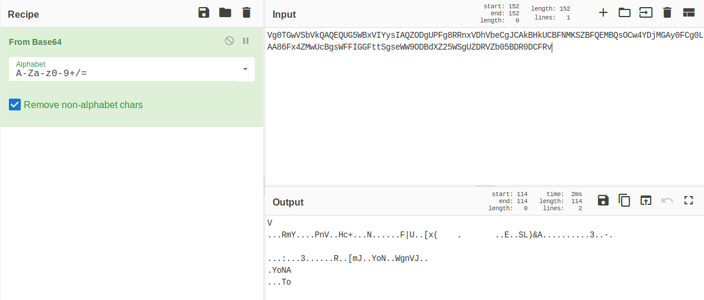
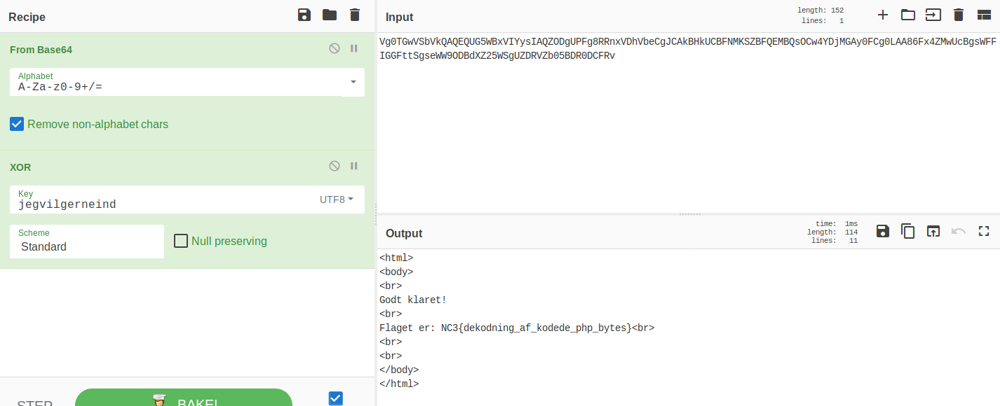

# reversing_kan-du-dekode.php

[Download](../bin/reversing_kan-du-dekode.php)

**Mål:** Tænke kreativt omkring dekodning af krypterede data.

Filen indeholder et [PHP](https://da.wikipedia.org/wiki/PHP) script:

```PHP
<?php $krypteret_indhold=base64_decode('Vg0TGwVSbVkQAQEQUG5WBxVIYysIAQZODgUPFg8RRnxVDhVbeCgJCAkBHkUCBFNMKSZBFQEMBQsOCw4YDjMGAy0FCg0LAA86Fx4ZMwUcBgsWFFIGGFttSgseWW9ODBdXZ25WSgUZDRVZb05BDR0DCFRv');


$kodeord = isset($_REQUEST['kodeord']) ? $_REQUEST['kodeord'] : "-";
$dekrypteret_indhold = '';

for($i = 0; $i < strlen($krypteret_indhold); $i++)
{
	$currentKodeordChar = ord($kodeord[$i % strlen($kodeord)]);
	$dekrypteret_indhold .= chr( (ord($krypteret_indhold[$i]) ^ $currentKodeordChar) % 256 );
}


if(MD5($dekrypteret_indhold)=='dc3f282720e8aea4a4b12cb82ea5a612')
{
	echo $dekrypteret_indhold;
}
else {
	echo '<form method="post" action="reversing_kan-du-dekode.php"><input type="text" name="kodeord" value=""/><input type="submit" value="&gt;"/></form>';
}

?>
```

Funktioner/variabler er navngivet så de er nemme at forstå. Det bemærkes at man ikke skal være PHP ekspert for at finde en løsning, da koden egentlig er ret simpel:

1. Dekod [Base64](https://da.wikipedia.org/wiki/Base64), og gem i variablen ```$krypteret_indhold```
2. Tag nu hver byte i ```$krypteret_indhold``` og [XOR](https://en.wikipedia.org/wiki/Exclusive_or) med brugerens kodeord.
3. Resultatet bliver hashet med [MD5](https://da.wikipedia.org/wiki/MD5), og skal give et [hard kodet](https://en.wikipedia.org/wiki/Hard_coding) facit.

Første indskydelse ville være at søge på nettet efter MD5-værdien:

```
dc3f282720e8aea4a4b12cb82ea5a612
```

Dette finder ikke noget. Så nemt skulle det ikke være.

En anden måde kunne være at lave/programmere/scripte en [brute forcer](https://da.wikipedia.org/wiki/Brute_force). Lad os lige se hvad [CyberChef](https://gchq.github.io) giver, alene ved base64 dekodning:



Udover at resultatet er garbage data, så kan vi se at resultatet af de 152 bytes, der udgør base64-enkodningen, bliver til 114 dekodede bytes. Hmm, 114 bytes er rigtig meget at skulle brute force. Det er derfor ikke realistisk, og vi må tænke andre veje.

Hvis vi ser nærmere på PHP koden, kan vi se at resultatet bliver brugt efterfølgende:

```PHP
echo $dekrypteret_indhold;
```

Kaldet til [echo](https://www.php.net/echo) fortæller os at det dekodede resultat er HTML kode. Dvs. vi ved allerede nu at det mulige indhold vil opfylde følgende kriterier:

* Almindeligt læsbare tegn i [ASCII-tabellen](https://da.wikipedia.org/wiki/ASCII). Dvs. vi reducerer de mulige tegn fra 256 til f.eks. Python's [string.printable](https://docs.python.org/2/library/string.html#string.printable).
* Der vil højst sandsynligt stå diverse [HTML tags](https://www.w3schools.com/tags/ref_byfunc.asp) i det dekodede resultat.


## Første gennemgang

Ideen er at lave en intelligent brute forcer, der tager ovennævnte med i overvejelserne.

Først kan vi løbe alle de mulige kodeordstegn igennem. Vi laver derfor en tekst-streng med disse muligheder:

```Python
muligeKodeordsTegn = "abcdefghijklmnopqrstuvwxyzABCDEFGHIJKLMNOPQRSTUVWXYZ0123456789_-"
```

Der er her 64 tegn, og et af dem må være det første tegn i kodeordet. Vi kan nu forsøge hvert af de 64 tegn i en brute forcer. Denne implementeres f.eks. i [Python](https://www.python.org/) (meget brugt i [infosec](https://en.wikipedia.org/wiki/Information_security)):

```Python
def Decrypt(krypteret_indhold, kodeord) :
	r = ''
	kodeordLen = len(kodeord)
	for i in range(0, len(krypteret_indhold)) :
		c = ord(krypteret_indhold[i]) ^ ord(kodeord[i % kodeordLen])
		r += chr(c)
	return r

def BruteForceFoersteKodeordsTegn(krypteret_indhold, muligeKodeordsTegn, muligeDekrypteredeTegn) :
	fundneMuligeTegn = set()
	for c in muligeKodeordsTegn :
		d = Decrypt(krypteret_indhold, c)
		if d[0:1] in muligeDekrypteredeTegn :
			fundneMuligeTegn.add(c)

	print "Mulige tegn til foerste kodeords tegn: ", len(fundneMuligeTegn), " : ", fundneMuligeTegn

krypteret_indhold = base64.b64decode('Vg0TGwVSbVkQAQEQUG5WBxVIYysIAQZODgUPFg8RRnxVDhVbeCgJCAkBHkUCBFNMKSZBFQEMBQsOCw4YDjMGAy0FCg0LAA86Fx4ZMwUcBgsWFFIGGFttSgseWW9ODBdXZ25WSgUZDRVZb05BDR0DCFRv')

muligeKodeordsTegn = "abcdefghijklmnopqrstuvwxyzABCDEFGHIJKLMNOPQRSTUVWXYZ0123456789_-"
muligeDekrypteredeTegn = string.printable

BruteForceFoersteKodeordsTegn(krypteret_indhold, muligeKodeordsTegn, muligeDekrypteredeTegn)
```

Output giver:

```
Mulige tegn til foerste kodeords tegn:  39  :  set(['-', '1', '0', '3', '2', '5', '4', '7', '6', '9', '8', 'Z', '_', 'a', 'c', 'b', 'e', 'd', 'g', 'f', 'i', 'h', 'k', 'j', 'm', 'l', 'o', 'n', 'q', 'p', 's', 'r', 'u', 't', 'w', 'v', 'y', 'x', 'z'])
```

Ok, så det første tegn i kodeordet går fra 64 mulige, til kun 39. Det er selvfølgelig fint nok, men det vil stadig potentielt tage meget lang tid at brute force hele kodeordet - som vi endnu ikke kender længden af.

Nu er det tid til at tænke lidt mere kreativt.

Vi har nu en lang krypteret tekst på 114 bytes, og vi ved at kodeordet nok er noget kortere. Det første tegn i kodeordet vil altså kunne dekode flere steder i det krypterede data - og ikke kun det første tegn. Denne egenskab kan vi bruge til at reducere antallet af mulige kodeordstegn yderligere.

## Længden på kodeordet
Først kan vi prøve at analysere hvor langt kodeordet potentielt skal være. Dette gøres ved at prøve alle 64 tegn som det første tegn i en tekst-streng med forskellige længder (lad os kalde det 'N'). Hvis det dekodede tegn for hver N'ne byte er i ```muligeDekrypteredeTegn``` så giver længden mening. Resultatet af dette er:

```Shell
Statistik: 
Laengde: 5 var ok 6 gange
Laengde: 7 var ok 5 gange
Laengde: 8 var ok 4 gange
Laengde: 9 var ok 10 gange
Laengde: 10 var ok 30 gange
Laengde: 11 var ok 30 gange
Laengde: 12 var ok 1 gange
Laengde: 13 var ok 15 gange
Laengde: 14 var ok 34 gange
Laengde: 15 var ok 6 gange
Kodeordet er nok 14 antal tegn langt ...
```

Så i princippet kunne længden være 5, 7, 8, osv. Men f.eks. er længderne 1, 2, 3, 4, 6 ikke mulige. Vi kan også se at 34 forskellige tegn kunne bruges ved længden 14, hvorimod kun 6 forskellige tegn kunne bruges hvis længden skulle være 5.

## Intelligent brute forcing

Det er svært at vide præcis hvilken data ```krypteret_indhold``` gemmer på. Vi kan gætte på HTML kode, men præcis hvilke tegn, der skal stå hvor, er simpelthen ikke muligt at vide. Der kan gættes på at den dekodede tekst skal starte med ```<HTML>``` eller ```<html>``` eller måske ```<HtmL>```, men det er slet ikke sikkert.

Vi prøver derfor at brute force, men hvor vi tjekker hver N'ne dekrypterede byte om den giver mening:

Lad os se på et eksempel med længden 4, og tegnet ```a```:

```Python
d = Decrypt(krypteret_indhold, "a???")
print d[0:1]
print d[4:5]
print d[8:9]
print d[12:13]
```

Giver:

```Shell
7
d
q
1
```

Mere visuelt:

| 0 | 1 | 2 | 3 | 4 | 5 | 6 | 7 | 8 | 9 | 10| 11| 12| 13| 14|
|-------|---|---|---|---|---|---|---|---|---|---|---|---|---|---|
|0x56|0xd|0x13|0x1b|0x5|0x52|0x6d|0x59|0x10|0x1|0x1|0x10|0x50|0x6e|0x56|
| a | ? | ? | ? | a | ? | ? | ? | a | ? | ? | ? | a | ? | ? |
|7|2|,|$|d|m|R|f|q|>|>|/|1|Q|i|

Husk på at alle andre kodeordstegn end det første ```a``` er garbage, og skal ignoreres:

| 0 | 1 | 2 | 3 | 4 | 5 | 6 | 7 | 8 | 9 | 10| 11| 12| 13| 14|
|-------|---|---|---|---|---|---|---|---|---|---|---|---|---|---|
|0x56|-|-|-|0x5|-|-|-|0x10|-|-|-|0x50|-|-|
| a | - | - | - | a | - | - | - | a | - | - | - | a | - | - |
|7|-|-|-|d|-|-|-|q|-|-|-|1|-|-|

Vi ved at alle de 4 dekodede tegn findes i ```muligeDekrypteredeTegn```. Nu er spørgsmålet om det giver mening for noget HTML kode at starte med et 7-tal, og have et ```d``` på index 4, osv. Det er svært at sige, men umiddelbart er svaret nej. På et tidspunkt vil det dekodede tegn i rækken dog ikke være i ```muligeDekrypteredeTegn```, når vi brute forcer med ```a``` som første tegn i det potentielle kodeord. Dette kunne vi se da vi analyserede længden på kodeordet, hvor ingen kodeord jo var på 4 tegn.


## Sæt i gang!

Da vi analyserede længden, var der stort udslag med tallet 14. Lad os derfor prøve alle kombinationer med længden 14. Husk på at vi hele tiden tjekker om hvert 14'ne dekodede tegn er i ```muligeDekrypteredeTegn```. Dette opfyldes jo af 34 forskellige tegn. Lad os [opdage disse via et script](support_files/reversing_kan-du-dekode.php.brute-forcer.py):

```Shell
b?????????????  ==  44m|lmz46
c?????????????  ==  55l}ml{57
d?????????????  ==  22kzjk|20
e?????????????  ==  33j{kj}31
f?????????????  ==  00ixhi~02
h?????????????  ==  >>gvfgp><
i?????????????  ==  ??fwgfq?=
j?????????????  ==  <<etder<>
k?????????????  ==  ==dueds=?
l?????????????  ==  ::crbct:8
m?????????????  ==  ;;bscbu;9
n?????????????  ==  88ap`av8:
o?????????????  ==  99`qa`w9;
r?????????????  ==  $$}l|}j$&
s?????????????  ==  %%|m}|k%'
t?????????????  ==  ""{jz{l" 
u?????????????  ==  ##zk{zm#!
v?????????????  ==    yhxyn "
w?????????????  ==  !!xiyxo!#
x?????????????  ==  ..wfvw`.,
y?????????????  ==  //vgwva/-
z?????????????  ==  ,,udtub,.
0?????????????  ==  ff?.>?(fd
1?????????????  ==  gg>/?>)ge
2?????????????  ==  dd=,<=*df
3?????????????  ==  ee<-=<+eg
4?????????????  ==  bb;*:;,b`
5?????????????  ==  cc:+;:-ca
6?????????????  ==  ``9(89.`b
7?????????????  ==  aa8)98/ac
8?????????????  ==  nn7&67 nl
9?????????????  ==  oo6'76!om
_?????????????  ==  		PAQPG	
-?????????????  ==  {{"3#"5{y
```

Alle 34 tegn giver 9 forskellige dekodede tegn, der alle ligger inde i ```muligeDekrypteredeTegn```.

Her må man selv vurdere hvilke tegn, der mest ligner HTML. Der er givetvis flere forskellige, og vi bør bide mærke i disse. Men umiddelbart ligner det at kodeordet starter med ```j```. Dette gættes udfra at HTML kode ofte starter med ```<```, hvilket kun ```j``` gør. Lad os derfor prøve en ny brute force, hvor første tegn er ```j```, og andet tegn bliver brute forcet:

```Shell
jb????????????  ==  <o<eest'dieXr9<(>
jc????????????  ==  <n<dert&dheYr8<)>
jd????????????  ==  <i<ceut!doe^r?<.>
je????????????  ==  <h<bett dne_r></>

jf????????????  ==  <k<aewt#dme\r=<,>	
j0????????????  ==  <=<7e!tud;e
rk<z>_
j1????????????  ==  <<<6e ttd:erj<{>^
j3????????????  ==  <><4e"tvd8e	rh<y>\
j6????????????  ==  <;<1e'tsd=erm<|>Y
rl<}>X
```

Husk på at vores tanke er at det dekodede data måske starter med ```<html>```. Det giver derfor mening at kodeordet starter med ```je```.
Lad os prøve at brute force det 3. tegn:

```Shell
jea???????????  ==  <hr<btet't cdnoe_vr></d>

jed???????????  ==  <hw<bqet"t fdnje_sr>	</a>

jef???????????  ==  <hu<bset t ddnhe_qr></c>

jeg???????????  ==  <ht<bret!t ednie_pr>
</b>

jeJ???????????  ==  <hY<b_ett HdnDe_]r>'</O>

t IdnEe_\r>&</N>

jeL???????????  ==  <h_<bYet
t NdnBe_[r>!</I>

jeM???????????  ==  <h^<bXett OdnCe_Zr> </H>

jeO???????????  ==  <h\<bZet	t MdnAe_Xr>"</J>

je0???????????  ==  <h#<b%etvt 2dn>e_'r>]</5>

je1???????????  ==  <h"<b$etwt 3dn?e_&r>\</4>

je2???????????  ==  <h!<b'ettt 0dn<e_%r>_</7>

je3???????????  ==  <h <b&etut 1dn=e_$r>^</6>

je4???????????  ==  <h'<b!etrt 6dn:e_#r>Y</1>

je5???????????  ==  <h&<b etst 7dn;e_"r>X</0>

je6???????????  ==  <h%<b#etpt 4dn8e_!r>[</3>

je7???????????  ==  <h$<b"etqt 5dn9e_ r>Z</2>

je8???????????  ==  <h+<b-et~t :dn6e_/r>U</=>

je-???????????  ==  <h><b8etkt /dn#e_:r>@</(>

```

Hvis ```jeg``` bruges, afsløres et HTML tag; ```</b>```. Dette tag betyder "slut på fed skrift". Dertil ses at vores forventning om at den dekrypterede tekst starter med ```<html>``` også kun bliver opfyldt med ```jeg``` som starten på kodeordet.
Vi går videre med det 4. kodeordstegn:

```Shell
jegp??????????  ==  <htk<br8et!t etdnihe_pnr>
:</bi>

t eudniie_por>
;</bh>

jegu??????????  ==  <htn<br=et!	t eqdnime_pkr>
?</bl>

jegv??????????  ==  <htm<br>et!
t erdnine_phr>
<</bo>

jegw??????????  ==  <htl<br?et!t esdnioe_pir>
=</bn>

jegA??????????  ==  <htZ<br	et!=t eEdniYe_p_r>
</bX>

jegC??????????  ==  <htX<bret!?t eGdni[e_p]r>
	</bZ>

jeg0??????????  ==  <ht+<brxet!Lt e4dni(e_p.r>
z</b)>

jeg1??????????  ==  <ht*<bryet!Mt e5dni)e_p/r>
{</b(>

jeg2??????????  ==  <ht)<brzet!Nt e6dni*e_p,r>
x</b+>

jeg3??????????  ==  <ht(<br{et!Ot e7dni+e_p-r>
y</b*>

jeg4??????????  ==  <ht/<br|et!Ht e0dni,e_p*r>
~</b->

jeg6??????????  ==  <ht-<br~et!Jt e2dni.e_p(r>
|</b/>

jeg8??????????  ==  <ht#<brpet!Dt e<dni e_p&r>
r</b!>

jeg9??????????  ==  <ht"<brqet!Et e=dni!e_p'r>
s</b >

jeg-??????????  ==  <ht6<breet!Qt e)dni5e_p3r>
g</b4>

```

Hvis der startes med ```jegv``` så kan der måske snart stå ```<html>```. Videre til femte kodeordstegn:

```Shell
jegvh?????????  ==  <htmm<br>et!
=t er;dninfe_phqr>
<c</boe>

jegvi?????????  ==  <html<br>
et!
<t er:dninge_phpr>
<b</bod>

jegvj?????????  ==  <htmo<br>	et!
?t er9dninde_phsr>
<a</bog>

et!
;t er=dnin`e_phwr>
<e</boc>

jegvo?????????  ==  <htmj<br>et!
:t er<dninae_phvr>
<d</bob>

jegvX?????????  ==  <htm]<br>;et!
t erdninVe_phAr>
<S</boU>

jegvY?????????  ==  <htm\<br>:et!
t er
dninWe_ph@r>
<R</boT>

jegv0?????????  ==  <htm5<br>Set!
et ercdnin>e_ph)r>
<;</bo=>

jegv1?????????  ==  <htm4<br>Ret!
dt erbdnin?e_ph(r>
<:</bo<>

jegv2?????????  ==  <htm7<br>Qet!
gt eradnin<e_ph+r>
<9</bo?>

jegv3?????????  ==  <htm6<br>Pet!
ft er`dnin=e_ph*r>
<8</bo>>

jegv4?????????  ==  <htm1<br>Wet!
at ergdnin:e_ph-r>
<?</bo9>

jegv5?????????  ==  <htm0<br>Vet!
`t erfdnin;e_ph,r>
<></bo8>

jegv6?????????  ==  <htm3<br>Uet!
ct erednin8e_ph/r>
<=</bo;>

jegv7?????????  ==  <htm2<br>Tet!
bt erddnin9e_ph.r>
<<</bo:>

jegv8?????????  ==  <htm=<br>[et!
mt erkdnin6e_ph!r>
<3</bo5>

jegv9?????????  ==  <htm<<br>Zet!
lt erjdnin7e_ph r>
<2</bo4>

jegv_?????????  ==  <htmZ<br><et!

t erdninQe_phFr>
<T</boR>

jegv-?????????  ==  <htm(<br>Net!
xt er~dnin#e_ph4r>
<&</bo >

```

Det rigtige må være ```jegvi```. Videre til sjette kodeordstegn:


```Shell
jegvib????????  ==  <html0<br>
Iet!
<lt er:.dningQe_phpQr>
<b|</bodw>

jegvic????????  ==  <html1<br>
Het!
<mt er:/dningPe_phpPr>
<b}</bodv>

jegvid????????  ==  <html6<br>
Oet!
<jt er:(dningWe_phpWr>
<bz</bodq>

jegvie????????  ==  <html7<br>
Net!
<kt er:)dningVe_phpVr>
<b{</bodp>

jegvif????????  ==  <html4<br>
Met!
<ht er:*dningUe_phpUr>
<bx</bods>

jegvig????????  ==  <html5<br>
Let!
<it er:+dningTe_phpTr>
<by</bodr>

jegvih????????  ==  <html:<br>
Cet!
<ft er:$dning[e_php[r>
<bv</bod}>

jegvii????????  ==  <html;<br>
Bet!
<gt er:%dningZe_phpZr>
<bw</bod|>

jegvik????????  ==  <html9<br>
@et!
<et er:'dningXe_phpXr>
<bu</bod~>

jegvil????????  ==  <html><br>
Get!
<bt er: dning_e_php_r>
<br</body>

jegvim????????  ==  <html?<br>
Fet!
<ct er:!dning^e_php^r>
<bs</bodx>

jegvin????????  ==  <html<<br>
Eet!
<`t er:"dning]e_php]r>
<bp</bod{>

jegvio????????  ==  <html=<br>
Det!
<at er:#dning\e_php\r>
<bq</bodz>

jegvip????????  ==  <html"<br>
[et!
<~t er:<dningCe_phpCr>
<bn</bode>

jegvir????????  ==  <html <br>
Yet!
<|t er:>dningAe_phpAr>
<bl</bodg>

jegvis????????  ==  <html!<br>
Xet!
<}t er:?dning@e_php@r>
<bm</bodf>

jegvit????????  ==  <html&<br>
_et!
<zt er:8dningGe_phpGr>
<bj</boda>

jegviu????????  ==  <html'<br>
^et!
<{t er:9dningFe_phpFr>
<bk</bod`>

jegviv????????  ==  <html$<br>
]et!
<xt er::dningEe_phpEr>
<bh</bodc>

jegviw????????  ==  <html%<br>
\et!
<yt er:;dningDe_phpDr>
<bi</bodb>

jegvix????????  ==  <html*<br>
Set!
<vt er:4dningKe_phpKr>
<bf</bodm>

jegviy????????  ==  <html+<br>
Ret!
<wt er:5dningJe_phpJr>
<bg</bodl>

jegviz????????  ==  <html(<br>
Qet!
<tt er:6dningIe_phpIr>
<bd</bodo>

```

Ok til ```jegvil```. Syvende:

```Shell
jegvila???????  ==  <html><br>
Giet!
<btt er: Hdning_ge_php_dr>
<br8</body8>

jegvild???????  ==  <html>	<br>
Glet!
<bqt er: Mdning_be_php_ar>
<br=</body=>

jegvilf???????  ==  <html><br>
Gnet!
<bst er: Odning_`e_php_cr>
<br?</body?>

jegvilg???????  ==  <html>
<br>
Goet!
<brt er: Ndning_ae_php_br>
<br></body>>

jegvilP???????  ==  <html>=<br>
GXet!
<bEt er: ydning_Ve_php_Ur>
<br	</body	>

jegvilR???????  ==  <html>?<br>
GZet!
<bGt er: {dning_Te_php_Wr>
<br</body>

jegvilS???????  ==  <html>><br>
G[et!
<bFt er: zdning_Ue_php_Vr>
<br
</body
>

jegvilT???????  ==  <html>9<br>
G\et!
<bAt er: }dning_Re_php_Qr>
>

jegvilU???????  ==  <html>8<br>
G]et!
<b@t er: |dning_Se_php_Pr>
<br</body>

```

Vi springer nu lidt, og ser på 14. kodeordstegn:

```Shell
...
jegvilgerneind  ==  <html>
<body>
<br>
Godt klaret!
<br>
Flaget er: NC3{dekodning_af_kodede_php_bytes}<br>
<br>
<br>	
</body>
</html>
...
```

Visualiseret i CyberChef:




&nbsp;
&nbsp;
&nbsp;
&nbsp;

Denne opgave krævede en del arbejde at løse. Derfor fik man også en del point for den. Tillykke til de 28 hold/personer i konkurrencen, der kom igennem denne opgave.

&nbsp;
&nbsp;
&nbsp;
&nbsp;


## Community Writeups:

https://github.com/kkthxbye-code/NC3-CTF-2018-Writeup

https://github.com/NicolaiSoeborg/ctf-writeups/tree/master/2018/NC3%20Jule%20CTF%202018
