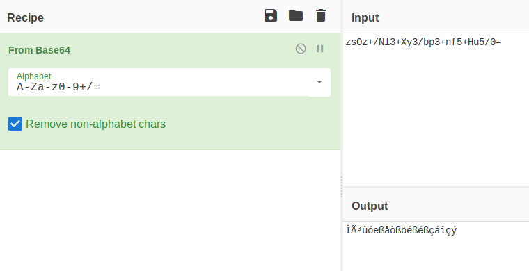
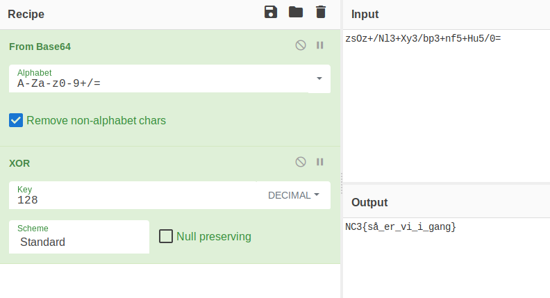

# reversing_små-skridt.html

[Download](../bin/reversing_små-skridt.html)

**Mål:** Introducerer Base64 og XOR, samt forståelsen af at vende en algoritme om (reversing).

Filen indeholder noget HTML kode, der styres af Javascript:

```HTML
<!DOCTYPE html />
<meta charset="UTF-8">
<html>
<body>

<script>
	function OnClick()
	{
		var flagValue = document.getElementById("flagInput").value;
		var xorFlag = '';
		for (var i = 0; i < flagValue.length; i++)
		{
			xorFlag += String.fromCharCode(128 ^ flagValue.charCodeAt(i));
		}

		if (xorFlag == atob("zsOz+/Nl3+Xy3/bp3+nf5+Hu5/0="))
		{
			alert('Du fandt flaget');
		}
		else
		{
			alert('Prøv igen');
		}

		console.log(xorFlag);
	}
</script>


<input type="text" id="flagInput" value="Indtast flaget:" />
<input type="button" onclick="OnClick();" />

</body>
</html>
```

Funktioner/variabler er navngivet så de er nemme at forstå. Netop via variablenavnet "xorFlag" introduceres konceptet [XOR](https://en.wikipedia.org/wiki/Exclusive_or) hvilket bruges meget i kryptografi.

Når man reverser en algoritme er det en god ide at kigge efter "validation checks", dvs. kode, der validerer input. I denne kode findes kun et enkelt sådan tjek:

```JavaScript
if (xorFlag == atob("zsOz+/Nl3+Xy3/bp3+nf5+Hu5/0="))
```

Vi kan se at [atob](https://www.w3schools.com/jsref/met_win_atob.asp) dekoder en [Base64](https://da.wikipedia.org/wiki/Base64) tekst. Lad os derfor starte med denne. Ligesom i [indledning](reversing_indledning.html.md) vil vi her bruge [CyberChef](https://gchq.github.io):

Vi starter med at finde en base64 dekoder:



Det ses at OUTPUT er [garbage](https://en.wikipedia.org/wiki/Data_corruption). Dette giver mening da vi jo ikke har vendt hele algoritmen om endnu. Vi kigger derfor på koden FØR validation tjekket:

```JavaScript
		var flagValue = document.getElementById("flagInput").value;
		var xorFlag = '';
		for (var i = 0; i < flagValue.length; i++)
		{
			xorFlag += String.fromCharCode(128 ^ flagValue.charCodeAt(i));
		}
```

Denne kode bruger konceptet XOR, hvilket både vises i variabelnavnet "xorFlag", men som også ses ved brugen af tegnet:

```
^
```

Dette tegn angiver (i mange programmeringssprog) at to variabler skal XOR'es med hinanden. I dette tilfælde bliver hvert tegn i "flagValue" XOR'et med en konstant; ```128```. Lad os derfor tilføje denne XOR operation til den eksisterende base64 "opskrift" i CyberChef:





&nbsp;
&nbsp;
&nbsp;
&nbsp;

Pointen her er at når der reverses, så vender man "bare" algoritmen om. Dvs. for at kryptere flaget skal XOR først, og derefter Base64, men når man reverser algoritmen skal Base64 først og derefter XOR.

&nbsp;
&nbsp;
&nbsp;
&nbsp;


## Community Writeups:

https://github.com/kkthxbye-code/NC3-CTF-2018-Writeup
